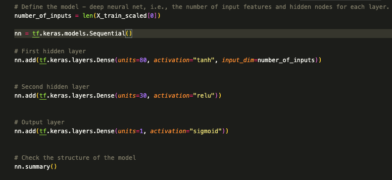

# deep-learning-challenge

## Overview

The nonprofit foundation Alphabet Soup wants a tool that can help it select the applicants for funding with the best chance of success in their ventures. With your knowledge of machine learning and neural networks, you’ll use the features in the provided dataset to create a binary classifier that can predict whether applicants will be successful if funded by Alphabet Soup.

## Results

### Data Preprocessing

#### What variables are the targets for your model?

The target for my model was the IS_SUCCESSFUL column 

#### What variables are the features for your model?

**The features for my model were:**

- AFFILIATION—Affiliated sector of industry
- CLASSIFICATION—Government organization classification
- USE_CASE—Use case for funding
- ORGANIZATION—Organization type
- STATUS—Active status
- INCOME_AMT—Income classification
- SPECIAL_CONSIDERATIONS—Special considerations for application
- ASK_AMT—Funding amount requested

#### What variables should be removed from the input data because they are neither targets nor features?

I removed the NAME, and EIN variables because they did not directly impact the accuracy of the model.

### Compiling, Training, and Evaluating the Model

#### How many neurons, layers, and activation functions did you select for your neural network model, and why?

**Attempt 1**  

  

I used 2 hidden layers.  Layer 1 had 80 neurons, layer 2 had 30 neurons and the ouput layer had 1.  I used tann and relu for the activation methods on the hidden layers and sigmoid for the ouput layer.  

**Attempt 2**  

  

I used 3 hidden layers. Layer 1 had 100 neurons, layer 2 had 60 neurons and layer 3 gd 20 neurons. I used all relu activation functions, except the output layer which was sigmoid, in hopes that it would increase my models accuracy.  

**Attempt 2**  

  

I used 3 hidden layers. Layer 1 had 100 neurons, layer 2 had 60 neurons and layer 3 gd 20 neurons. I used all tanh activation functions, except the output layer which was sigmoid, in hopes that it would increase my models accuracy.  

#### Were you able to achieve the target model performance?

I was unable to reach the target model performance in all three attempts. This is something I need to further research to figure out why I could not reach the performance accuracy I wanted to achieve. 

#### What steps did you take in your attempts to increase model performance?

I tried using more nuerons, more hidden layers and different activation functions to improve accuracy. Doing this did not end up in the result I was hoping for, maybe trying different bin sizes or less hidden layers with different neuron counts would help fix this problem. 

### Summary

An applicant will be around 72% more successful in being funded if they:  
- Have classification: C1000, C2000, C1200, C2100, C3000.
- Have more that 20 applications submitted.
- Have application type: T3, T4, T6, T5 and T19
 

An alternative model to recommend would be an Ensemble Model. I recommend this this suggestion because it combines multiple models to improve performance by using techniques such as boosting and stacking. 
